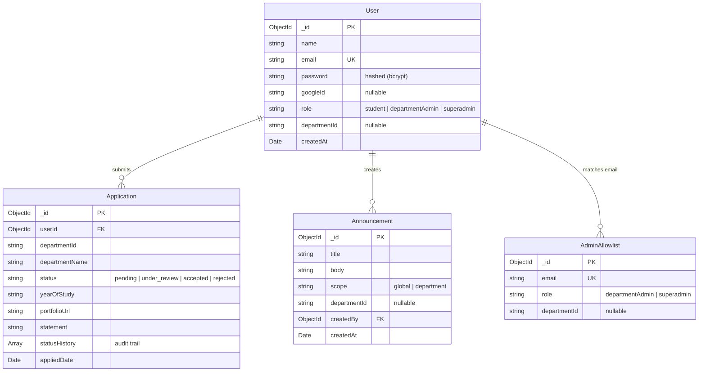

# GDG On Campus — Recruitment Platform

A high-performance, full-stack recruitment portal and administrative dashboard built for Google Developer Groups (GDG) On Campus. The platform streamlines student applications across technical tracks, features an interactive 3D department showcase, provides role-based administration, and includes real-time application review workflows.

---

## Overview

The **GDG On Campus Recruitment Platform** bridges the gap between university students aspiring to join GDG technical chapters and department leads reviewing candidate applications.

- **What it does:** Enables candidates to browse departments through an immersive 3D WebGL interface, submit standardized applications with portfolio links and motivation statements, and monitor their application lifecycle in real time. Provides department leads and super administrators with comprehensive dashboards, application filtering, status management, and announcement broadcasts.
- **Who uses it:** University students, Technical Department Leads (DSA, Web Dev, AI/ML, Operations, Production), and GDG Executive Super Admins.
- **The problem it solves:** Eliminates fragmented Google Forms and spreadsheets with a centralized, secure, role-governed recruitment lifecycle with audit trails and automated role derivation.

---

## Features

- **Interactive 3D WebGL Department Showcase:** Powered by Three.js with real-time dynamic canvas rendering, custom GLSL wave mesh backgrounds, and interactive carousel physics.
- **Dual Authentication System:** Secure email/password authentication (salted bcrypt + HTTP-only JWT cookies) and seamless Google Identity Services OAuth 2.0 with token verification.
- **Server-Side Role-Based Access Control (RBAC):** Strict backend middleware (`authenticate`, `requireAdmin`, `requireRole`) safeguarding administrative endpoints.
- **Multi-Role Scoped Administration:** Department Leads only access applications and stats belonging to their respective department, while Super Admins maintain global oversight.
- **Application Lifecycle Management:** Full status transitions (`pending` &rarr; `under_review` &rarr; `accepted` / `rejected`) accompanied by timestamped audit history and review notes.
- **Targeted Announcements System:** Publish broadcasts globally to all enrolled candidates or scoped directly to specific department applicants.
- **Responsive Dark-Themed Design:** Crafted with modern typography (Geist Variable), smooth framer-motion micro-interactions, responsive mobile navigation drawer, and GDG brand identity styling.
- **Resilient API Architecture:** Centralized error sanitization, gentle rate limiting on authentication routes, and unified development proxying with production CORS configuration.

---

## User Roles & Capabilities

| Role | Permissions & Capabilities |
| :--- | :--- |
| **Student** | <ul><li>Register & sign in via email/password or Google OAuth.</li><li>Explore technical departments via interactive 3D showcase.</li><li>Submit applications with portfolio links and motivational statements.</li><li>Track personal application statuses in real time.</li><li>View global and department-specific announcements.</li></ul> |
| **Department Lead**<br>*(e.g., Web, DSA, AI/ML)* | <ul><li>Access dedicated Department Admin dashboard.</li><li>View candidate statistics scoped strictly to their assigned department.</li><li>Filter and search department applicants by name, email, or status.</li><li>Update application review status (`under_review`, `accepted`, `rejected`) with notes.</li><li>Broadcast department-scoped announcements to applicants.</li></ul> |
| **Super Admin** | <ul><li>Global administrative dashboard with cross-department analytics.</li><li>Inspect all candidate applications across all tracks.</li><li>Full authority over application statuses and audit notes.</li><li>Publish both global and track-specific platform announcements.</li><li>Manage platform allowlist and role elevations.</li></ul> |

---

## Tech Stack

### Frontend
- **Framework:** [React 19](https://react.dev/) + [Vite 8](https://vite.dev/)
- **Styling:** [Tailwind CSS v4](https://tailwindcss.com/) + [tw-animate-css](https://www.npmjs.com/package/tw-animate-css)
- **3D & Visual Graphics:** [Three.js](https://threejs.org/) (Custom Shaders, InstancedMesh Wave Grid, Dynamic Canvas Textures)
- **Animations:** [Framer Motion](https://www.framer.com/motion/) & [Motion](https://motion.dev/)
- **Typography:** [Geist Variable](https://fontsource.org/fonts/geist) via Fontsource
- **Icons:** [Lucide React](https://lucide.dev/)
- **Authentication Client:** [@react-oauth/google](https://www.npmjs.com/package/@react-oauth/google)

### Backend
- **Runtime:** [Node.js](https://nodejs.org/) (ES Modules)
- **Framework:** [Express 5](https://expressjs.com/)
- **Database ODM:** [Mongoose 9](https://mongoosejs.com/)
- **Authentication:** [jsonwebtoken](https://www.npmjs.com/package/jsonwebtoken) (HTTP-only cookies) + [bcrypt](https://www.npmjs.com/package/bcrypt)
- **Google Verification:** [google-auth-library](https://www.npmjs.com/package/google-auth-library) (OAuth2Client)
- **Validation:** [Zod 4](https://zod.dev/)
- **Security:** [cors](https://www.npmjs.com/package/cors), [cookie-parser](https://www.npmjs.com/package/cookie-parser), [express-rate-limit](https://www.npmjs.com/package/express-rate-limit)

### Database
- **Provider:** [MongoDB Atlas](https://www.mongodb.com/atlas) (Cloud Cluster)

---

## Project Structure

```
GDG/
├── frontend/
│   ├── public/
│   │   └── favicon.svg              # GDG favicon
│   ├── src/
│   │   ├── assets/                  # Authentic brand logos and bracket graphics
│   │   │   ├── gdg-bracket-left.png
│   │   │   ├── gdg-bracket-right.png
│   │   │   └── gdg-logo-cropped.png
│   │   ├── components/
│   │   │   ├── ProtectedRoute.jsx   # Route guard with authentication & role checks
│   │   │   ├── SidebarLayout.jsx    # Unified dashboard layout with responsive sidebar
│   │   │   └── ui/                  # Reusable presentation & visual components
│   │   │       ├── books-showcase.jsx
│   │   │       ├── departments-showcase.jsx
│   │   │       ├── gdg-bracket.jsx
│   │   │       ├── gdg-hero-visual.jsx
│   │   │       ├── gdg-logo-fallback.jsx
│   │   │       ├── hero.jsx
│   │   │       ├── morph-text.jsx
│   │   │       ├── spotlight-navbar.jsx
│   │   │       ├── toaster.jsx
│   │   │       └── wave-grid-background.jsx
│   │   ├── context/
│   │   │   ├── AuthContext.jsx          # Session state and auth methods
│   │   │   └── ApplicationsContext.jsx  # Student application cache and submission
│   │   ├── data/
│   │   │   └── departments.js       # Department metadata & dynamic 2D canvas painters
│   │   ├── hooks/
│   │   │   ├── use-toast.js         # Reactive toast notification dispatcher
│   │   │   ├── useApplications.js   # Convenience hook for application context
│   │   │   └── useAuth.js           # Convenience hook for auth context
│   │   ├── lib/
│   │   │   ├── api.js               # Unified fetch wrapper with error sanitization & env base URL
│   │   │   ├── googleAuth.js        # Google OAuth configuration & validation helpers
│   │   │   └── utils.js             # Classnames helper (cn)
│   │   ├── pages/
│   │   │   ├── admin/               # Administrative views
│   │   │   │   ├── AdminAnnouncements.jsx
│   │   │   │   ├── AdminApplications.jsx
│   │   │   │   ├── AdminDepartments.jsx
│   │   │   │   ├── AdminLayout.jsx
│   │   │   │   └── AdminOverview.jsx
│   │   │   ├── dashboard/           # Student views
│   │   │   │   ├── StudentAnnouncements.jsx
│   │   │   │   ├── StudentApplications.jsx
│   │   │   │   └── StudentLayout.jsx
│   │   │   ├── ApplyDepartment.jsx  # Technical track application form
│   │   │   ├── Departments.jsx      # 3D interactive department browser
│   │   │   ├── Home.jsx             # Landing page with Three.js wave background
│   │   │   ├── Login.jsx            # Sign in with password or Google
│   │   │   └── Register.jsx         # Sign up with password or Google
│   │   ├── App.jsx                  # React Router v7 configuration
│   │   ├── index.css                # Tailwind design system & CSS custom properties
│   │   └── main.jsx                 # Client entry point
│   ├── .env.example                 # Frontend variable template
│   ├── .gitignore                   # Frontend ignore rules
│   ├── index.html                   # HTML entry with metadata
│   ├── package.json                 # Frontend dependencies & build scripts
│   └── vite.config.js               # Vite config with proxy & aliases
│
├── backend/
│   ├── authMiddleware.js            # JWT verification & role authorization middleware
│   ├── authRoutes.js                # Registration, login, Google token auth, and sessions
│   ├── models.js                    # Mongoose schemas (User, Allowlist, Application, Announcement)
│   ├── seedAdmin.js                 # CLI utility to seed or promote admin accounts
│   ├── server.js                    # Express app, CORS, rate limits, REST endpoints & DB connection
│   ├── .env.example                 # Backend variable template
│   ├── .gitignore                   # Backend ignore rules
│   └── package.json                 # Backend dependencies & startup scripts
│
├── .gitignore                       # Root ignore rules (safeguards all secrets & dependencies)
├── package.json                     # Root orchestrator scripts
└── README.md                        # Project documentation
```

---

## Local Setup & Installation

### Prerequisites
- [Node.js](https://nodejs.org/) (v18.0.0 or higher recommended)
- [npm](https://www.npmjs.com/) (v9.0.0 or higher)
- A [MongoDB Atlas](https://www.mongodb.com/atlas) connection string (or local MongoDB daemon)

### 1. Clone the Repository
```bash
git clone https://github.com/rawatpiyush727-rgb/GDG-RECRUITMENT.git
cd GDG-RECRUITMENT
```

### 2. Configure Backend
```bash
cd backend
npm install
cp .env.example .env
```
Edit `backend/.env` with your credentials:
```env
PORT=5000
MONGODB_URI=mongodb+srv://<username>:<password>@<cluster-url>/<dbname>?retryWrites=true&w=majority
JWT_SECRET=your_super_secret_jwt_key_here
GOOGLE_CLIENT_ID=your_google_client_id.apps.googleusercontent.com
NODE_ENV=development
```

### 3. Configure Frontend
```bash
cd ../frontend
npm install
cp .env.example .env
```
Edit `frontend/.env`:
```env
VITE_BACKEND_URL=http://localhost:5000
VITE_GOOGLE_CLIENT_ID=your_google_client_id.apps.googleusercontent.com
```

### 4. Run the Application

You can run both services independently:

**In Terminal 1 (Backend):**
```bash
cd backend
npm run dev
# Server will listen on http://localhost:5000
```

**In Terminal 2 (Frontend):**
```bash
cd frontend
npm run dev
# Frontend will start on http://localhost:5173
```

Alternatively, from the repository root:
```bash
npm run dev:backend   # Starts backend
npm run dev:frontend  # Starts frontend
```

Visit **`http://localhost:5173`** in your browser.

---

## Environment Variables

> [!IMPORTANT]
> Never commit actual `.env` files. Both `frontend/.env.example` and `backend/.env.example` are provided as templates.

### Backend (`backend/.env`)
| Variable | Description |
| :--- | :--- |
| `PORT` | Port number for Express server (default: `5000`) |
| `MONGODB_URI` | MongoDB Atlas or local connection string |
| `JWT_SECRET` | Secret key used to sign and verify session JWTs |
| `GOOGLE_CLIENT_ID`| Google OAuth 2.0 Web Client ID for ID token verification |
| `NODE_ENV` | Environment identifier (`development` or `production`) |
| `FRONTEND_URL` | *(Optional in production)* Allowed origin for CORS |

### Frontend (`frontend/.env`)
| Variable | Description |
| :--- | :--- |
| `VITE_BACKEND_URL` | Target address used by Vite dev proxy to route `/api/*` |
| `VITE_API_URL` | *(Optional)* Absolute backend base URL for production builds |
| `VITE_GOOGLE_CLIENT_ID`| Public Google OAuth Client ID for Google Identity Services |

---

## Demo & Evaluator Access

The platform supports role-based evaluation across three distinct roles:

### 1. Student Access
- **How to test:** Click **Sign In** &rarr; **Register**, or click **Sign In with Google**.
- **Actions:**
  - Browse technical tracks on `/departments`.
  - Apply to a track on `/departments/:slug/apply`.
  - Review submitted applications on `/dashboard`.
  - Read announcements posted for your department.

### 2. Department Lead Access
- **How to test:** Seed a department administrator using the CLI seeder:
  ```bash
  cd backend
  node seedAdmin.js lead@gdg.org departmentAdmin web
  ```
  *(Replace `web` with any department id: `dsa`, `web`, `aiml`, `ops`, `prod`)*.
- **Actions:**
  - Sign in with `lead@gdg.org`.
  - Access `/admin` to view real-time department statistics.
  - Review applications submitted to your specific department.
  - Update application statuses with review feedback.
  - Broadcast announcements to applicants in your department.

### 3. Super Admin Access
- **How to test:** Seed a super administrator using the CLI seeder:
  ```bash
  cd backend
  node seedAdmin.js admin@gdg.org superadmin
  ```
- **Actions:**
  - Sign in with `admin@gdg.org`.
  - Access global overview metrics across all 5 departments.
  - Search, filter, and review applications across all tracks.
  - Create and manage global announcements visible to all candidates.

---

## API & Backend Architecture

The backend REST API exposes structured endpoints under `/api`:

### Authentication (`/api/auth`)
- `POST /api/auth/register` — Validates credentials with Zod, hashes password with bcrypt, checks admin allowlist, and sets HTTP-only JWT cookie.
- `POST /api/auth/login` — Verifies email/password and issues JWT cookie.
- `POST /api/auth/google` — Verifies Google ID tokens via `google-auth-library`, provisions/links user in MongoDB, and issues JWT cookie.
- `GET /api/auth/me` — Returns the authenticated user's profile and active role.
- `POST /api/auth/logout` — Clears the authentication cookie.

### Applications (`/api/applications`)
- `GET /api/applications/mine` — *(Student)* Returns all applications submitted by the logged-in student.
- `POST /api/applications` — *(Student)* Creates or updates an application for a specific department.
- `GET /api/applications` — *(Admin)* Scoped search and filter of applications (filtered by department for `departmentAdmin`).
- `PATCH /api/applications/:id/status` — *(Admin)* Updates candidate status and appends entry to `statusHistory` audit trail.

### Admin Analytics (`/api/admin`)
- `GET /api/admin/stats` — Aggregates student counts, total applications, status breakdown, and per-department numbers.

### Announcements (`/api/announcements`)
- `GET /api/announcements/mine` — *(Student)* Returns global announcements and announcements for applied departments.
- `GET /api/announcements` — *(Admin)* Returns announcements scoped to the admin's permissions.
- `POST /api/announcements` — *(Admin)* Publishes a new global or department-targeted announcement.
- `PATCH /api/announcements/:id` — *(Admin)* Updates existing announcement content.
- `DELETE /api/announcements/:id` — *(Admin)* Removes an announcement.

### Health Check
- `GET /api/health` — Verifies server uptime and active MongoDB database connection status.

---

## Database Models

The MongoDB database contains four core collections:



---

## Deployment Architecture

The recommended production deployment topology:

- **Frontend:** [Render Static Site](https://render.com/) or [Vercel](https://vercel.com/)
  - Build Command: `npm run build`
  - Publish Directory: `dist`
  - Environment Variable: `VITE_API_URL=https://your-backend-api.onrender.com`
- **Backend:** [Render Web Service](https://render.com/)
  - Build Command: `npm install`
  - Start Command: `npm start`
  - Environment Variables: `MONGODB_URI`, `JWT_SECRET`, `GOOGLE_CLIENT_ID`, `NODE_ENV=production`, `FRONTEND_URL=https://your-frontend.onrender.com`
- **Database:** [MongoDB Atlas](https://www.mongodb.com/atlas) (M0/Serverless Free Tier)

---

## Security Highlights

- **Server-Side Authorization:** Role checks (`superadmin` vs `departmentAdmin`) are verified cryptographically in backend middleware on every request and never trusted from client-side state.
- **Password Protection:** Passwords hashed with salted `bcrypt` (10 rounds).
- **HTTP-Only Cookies:** JWT tokens stored in `httpOnly`, `sameSite: "lax"` cookies, protecting against XSS token theft.
- **Google OAuth Verification:** Tokens cryptographically verified against Google servers via official `google-auth-library` with clock skew tolerance.
- **Input Validation & Sanitization:** Strict Zod schema enforcement on registration and login.
- **Rate Limiting:** `express-rate-limit` guards against brute-force attacks on authentication routes.
- **Open Redirect Guard:** Frontend route redirection inspects query params to reject absolute, protocol-relative, and backslash exploits.
- **Zero Secrets Committed:** Comprehensive `.gitignore` and `.env.example` templates protect sensitive credentials.

---

## Credits & Third-Party Attribution

This application integrates established open-source libraries and visual design patterns:

- **Three.js** ([MIT License](https://github.com/mrdoob/three.js/blob/dev/LICENSE)): Core WebGL graphics rendering library utilized in `wave-grid-background.jsx` for the interactive 3D particle mesh and in `books-showcase.jsx` for the department showcase.
- **Framer Motion** ([MIT License](https://github.com/framer/motion/blob/main/LICENSE.md)): Smooth physics-based UI transitions and micro-interactions used across navigation, badges, and modal animations.
- **Lucide Icons** ([ISC License](https://github.com/lucide-icons/lucide/blob/main/LICENSE)): Standardized iconography for status indicators, actions, and navigation.
- **Tailwind CSS & tw-animate-css** ([MIT License](https://github.com/tailwindlabs/tailwindcss/blob/main/LICENSE)): Atomic styling system and animation keyframes.
- **Geist Font** ([SIL Open Font License](https://scripts.sil.org/OFL)): Variable font package by Vercel provided via `@fontsource-variable/geist`.
- **Google Developer Groups Brand Assets**: Authentic GDG logo and bracket vector geometry used under Google Developer Groups community guidelines.
